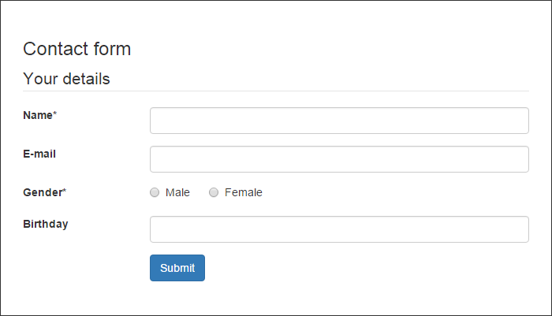
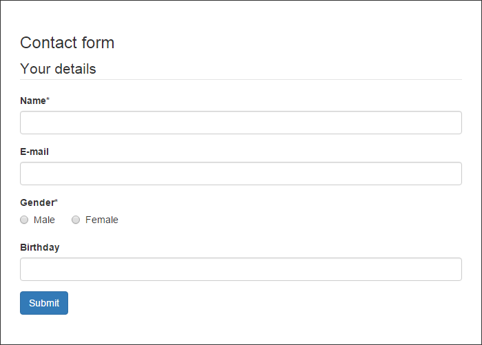
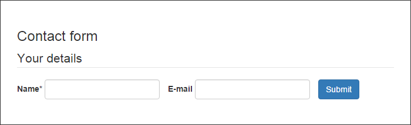

.. _start:

*************
Documentation
*************

This extension provides three different layouts for powermail forms.

Additionaly you can include a twitter bootstrap theme stylesheet.

Configuration
-------------

- Include the TypoScript setup "Powermail CSS" in your template.
- Adjust the TypoScript constants to your needs.
- Include the Page TS config "Powermail CSS" in your root page.

Screenshots
-----------

    Example form with horizontal layout and bootstrap theme.

    Example form with vertical layout and bootstrap theme.

    Example form with inline layout and bootstrap theme.